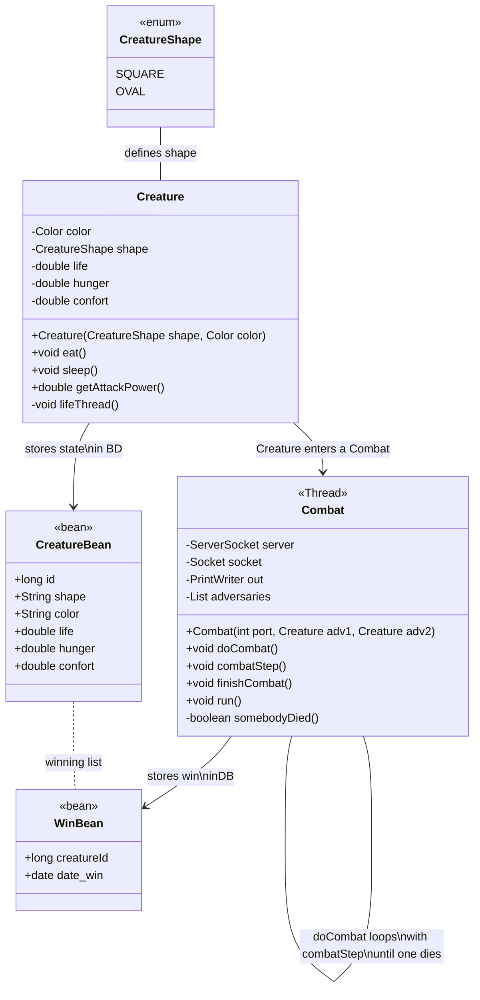
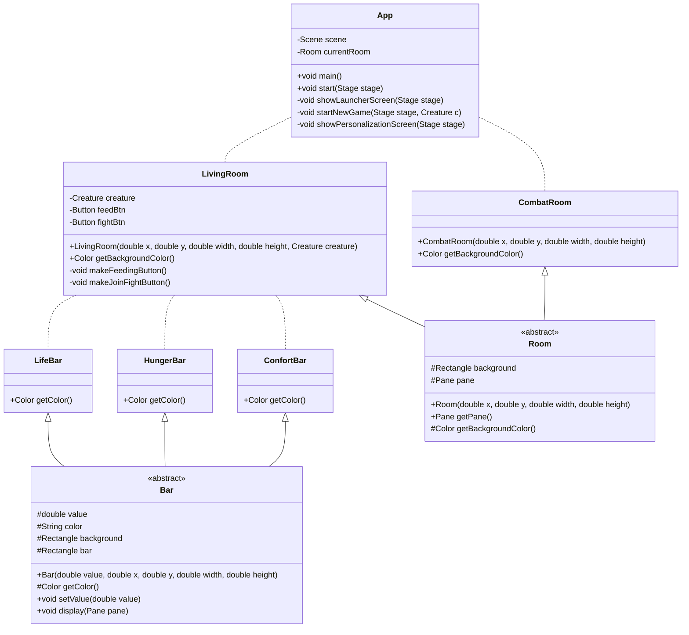
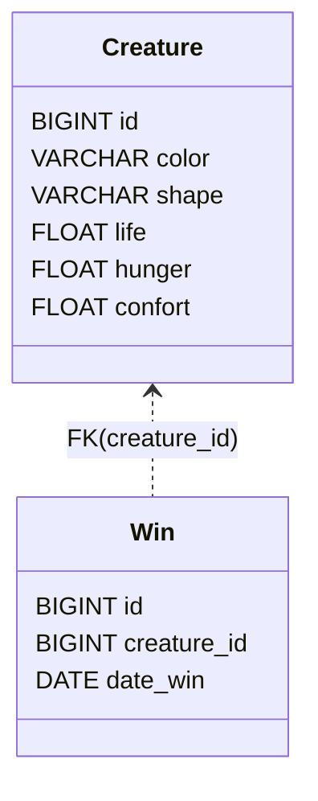
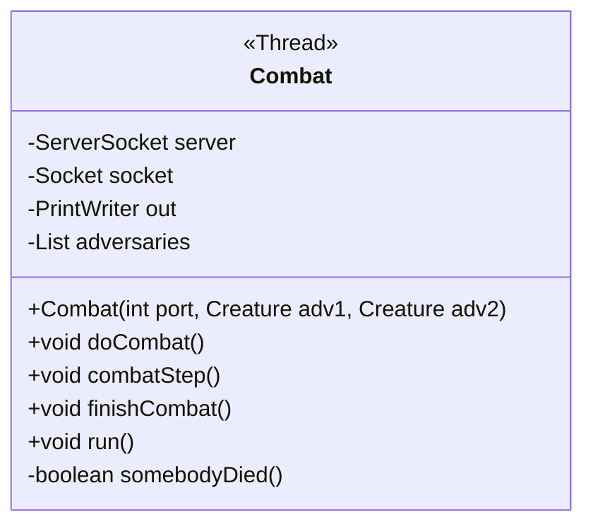

# Projet d'examen pratique en Java

## Concept et fonctionnalités

On se propose de réaliser un mini-jeu de gestion de créature de combat : __*Tamagochi Sensoo*__.

Le joueur doit s'occuper d'une créature personnalisée (couleur et forme simple dans une énumération). Il doit gérer sa faim, son moral et sa vie. Pour cela on se trouve dans un écran dans lequel de la nourriture apparait régulièrement et on dispose aussi de la possibilité de dormir (un simple boutton qui restaure un peu de vie et de confort mais baisse la faim). 

Un combat permet de faire s'affronter 2 créatures. Celui-ci est automatique et basé sur la chance ainsi que les statistiques des créatures à l'entrée en combat. On leur définit donc une puissance d'attaque qui sera la plus haute si ses 3 barres sont au maximum, cette puissance sera toujours pondérée aléatoirement, en tour par tour des deux créatures. En cas de victoire, le moral est remis au maximum, tandis que si on perd, le moral tombe bas. Les 2 participants perdent en barre de faim à la fin du combat, et en vie selon les attaques prises. Le joueur revient à la créature perdante une fois l'instance de combat terminée, pour penser ses plaies.

Qu'importe la raison (barres de faim ou de vie à 0) ou perte d'un combat, la créature revient avec sa vie à 10% et ses autres barres à 1%. Proportionnelement, une barre de confort faible augmente la vitesse de faim, une barre de faim à moins de 10% augmente la vitesse de perte de vie.

## Conception

> On utilise la syntaxe de diagrammes Mermaid : [documentation ClassDiagram](https://mermaid.js.org/syntax/classDiagram.html#class-diagrams). Il est notamment décrit la symbolique utilisée

### Classes fonctionnelles

### Classes graphiques

## JDBC

La base de donnée MySQL de _Tamagochi Sensoo_ est simple, elle consiste en 2 classes simples, reflétés dans une table chacune : 

La table `Creature` sert simplement à la sauvegarde de l'état des créatures du jouer. Avec `CreatureDao` on dispose des méthodes publiques suivantes : 
- `double save(Creature creature)` pour un UPDATE / INSERT dans `Creature`.
- `List<Creature> listCreatures()` pour lire la table `Creature`.
- `ListView<Creature> makeListView()`, une surcouche de `listCreatures()` pour formatter les résultat vers JavaFX.
- `void deleteFromId(double id)`, supprimer une créature.

Dans la table `Win`, on stocke les gagnant de chaque combat, à l'aide de la classe `WinDao`. Cette dernière implémente le tri par date des victoires, pour créer un tableau des scores (voir `getWins()`). On nottera particulièrement son utilisation dans le launcher et sa méthode `showScores()`, qui réalise une aggrégation de comptage : on sait par leur identifiants quelle créature à gagné combien de combats.

Afin d'encapsuler la création de connection avec le connecteur MySQL, nous avons en plus une classe `DatabaseConnection`, qui, en temps que classe mère des classes de DAO, fournit une simple méthode `getConnection()` qui nous permet de réaliser plus rapidement les requêtes vers la BDD.

## Exceptions

Dans le package correspondant, nous avons crée 2 exceptions spécifiques :
- `NoConfigFileException`, revoyée par `DatabaseConnection` et ses enfants, dans leurs constructeur. Lorsque l'on charge le fichier `config.ini` on encapsule ses erreurs `InvalidFileFormatException` et `IOException` dans cette nouvelle.
- `FightNotCreatedException` : lorsqu'une instance de la classe `Combat` tente d'etre créée, si le `SocketServer` renvoie une erreur, elle est encapsulée dans cette nouvelle erreur.

## Classe Combat

Cette classe est le controlleur d'un combat en cours. Elle réalise le calcul de chaque tour d'attaque. ET, à l'aide de sa propriété `server`, elle communique le déroulement aux classes (`CombatRoom`) en dehors du Thread de combat _via_ une socket.
En face, dans `CombatRoom`, un autre Thread `actionsThread` permet de recevoir les informations par la socket cliente, sans perturber l'affichage graphique.

De plus, elle se base sur sa collection `adversaries` pour notamment tester à chaque tour si une des créatures est mortes, ainsi que récupérer le gagnant et le perdant (méthode `finishCombat()`);

## Vues et controlleurs de vues

Les packages `Room` et `Bars` contiennent des classes qu'on peut appeler respectivement _controlleur de vue_ et _controlleur de composant_.

En effet, `Room` et ses descendantes, vont gérer l'écran principal et son contenu. Dans une LivingRoom, on s'occupe d'une créature, dans une CombatRoom on voit le combat se dérouler et dans une JoiningFightRoom, on montre la séléction des créatures qui devront combattre (lien entre LivingRoom et CombatRoom).

Tandis que le controlleur `Bar` et ses descendantes vont gérer l'état et l'affichage des différentes barres d'état : barre de vie, de confort et de faim.