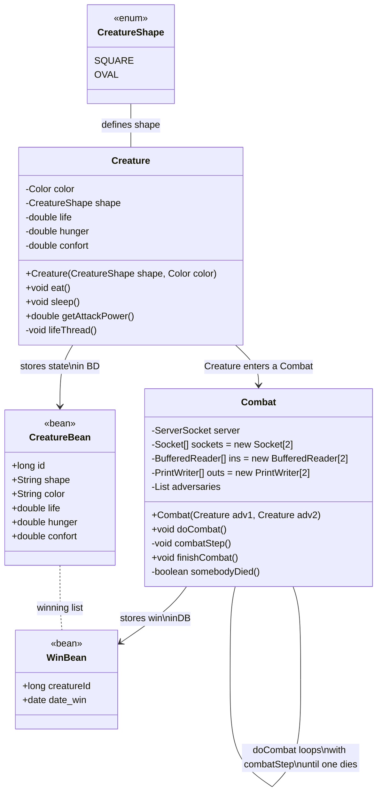
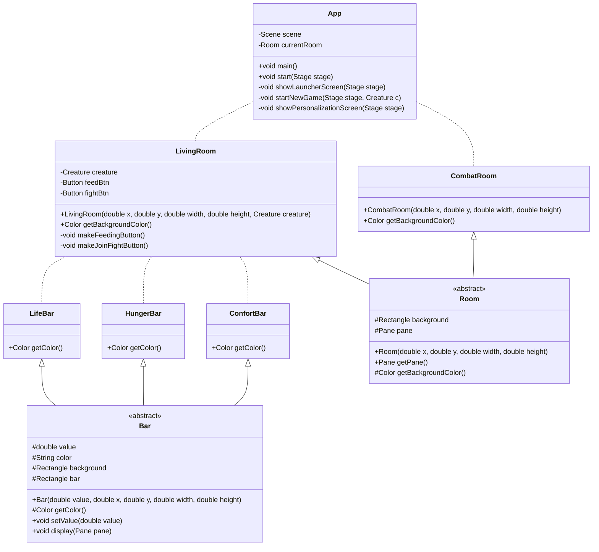

# Projet d'examen pratique en Java

## Concept et fonctionnalités

On se propose de réaliser un mini-jeu de gestion de créature de combat : __*Tamagochi Sensoo*__.

Le joueur doit s'occuper d'une créature personnalisée (couleur et forme simple dans une énumération). Il doit gérer sa faim, son moral et sa vie. Pour cela on se trouve dans un écran dans lequel de la nourriture apparait régulièrement et on dispose aussi de la possibilité de dormir (un simple boutton qui fait un fondu au noir et restaure un peu de vie et de confort mais baisse la faim). 

Lorsqu'une autre instance du jeu est disponible, les joueurs peuvent lancer un combat. Celui-ci est automatique et basé sur la chance ainsi que les statistiques des créatures à l'entrée en combat. On leur définit donc une puissance d'attaque qui sera la plus haute si ses 3 barres sont au maximum, cette puissance sera toujours pondérée aléatoirement, en tour par tour des deux créatures. En cas de victoire, le moral est remis au maximum, tandis que si on perd, le moral tombe bas. Les 2 participants perdent en barre de faim à la fin du combat, et en vie selon les attaques prises.

Qu'importe la raison (barres de faim ou de vie à 0) ou perte d'un combat, la créature revient avec sa vie à 10% et ses autres barres à 1%. Proportionnelement, une barre de confort faible augmente la vitesse de faim, une barre de faim à moins de 10% augmente la vitesse de perte de vie.

## Conception

> On utilise la syntaxe de diagrammes Mermaid : [documentation ClassDiagram](https://mermaid.js.org/syntax/classDiagram.html#class-diagrams). Il est notamment décrit la symbolique utilisée

### Classes fonctionnelles

### Classes graphiques

